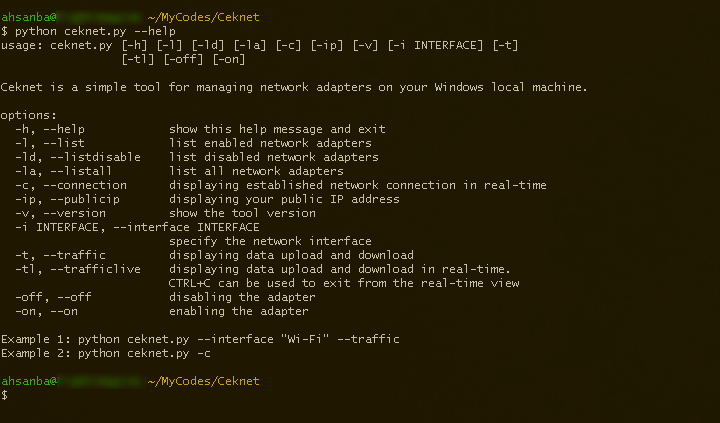

# Description
Ceknet is a simple tool for managing network adapters on your Windows local machine. Native for cmd and cygwin only. Requires netsh and psutil module to work properly.

# Background
Linux, especially Kali or Parrot, is like the ultimate cybersecurity superhero, catering to a multitude of security needs and packed with a lot of powerful commands, including all that network magic you can work with through the commmand-line. On the other hand, Windows boasts a ton of flashy GUI features but falls short on lightweight and straightforward CLI programs. Python is a lifesaver, making ceknet here to fill those gaps as I use it to learn more about networking.

# Installation
1. Install python.
2. Install psutil module in cmd terminal:
   pip install psutil
3. You may create a directory named 'Ceknet' for easy organizing. However, you can basically place it anywhere in the directory you like.
4. Copy the 'ceknet.py' file into the folder. You only need 'ceknet.py'. File with a .lang extension is for translation purposes. If you want it in English, you can ignore or delete the .lang file."
5. Head over to the 'Ceknet' folder and see if ceknet is working:
   python ceknet.py --help

# How to use:
You can add argument --help for more information.

# Credit
Special thanks to csbygb for her amazing pentest research, and to the many senior cybersecurity experts whose blogs I encountered along the way. This is amazing journey.

# References:
1. https://docs.python.org/3/library/index.html
2. https://psutil.readthedocs.io/en/latest/
3. https://docs.python.org/3/library/subprocess.html
4. https://learn.microsoft.com/en-us/windows-server/networking/technologies/netsh/netsh-contexts
5. https://csbygb.github.io/
